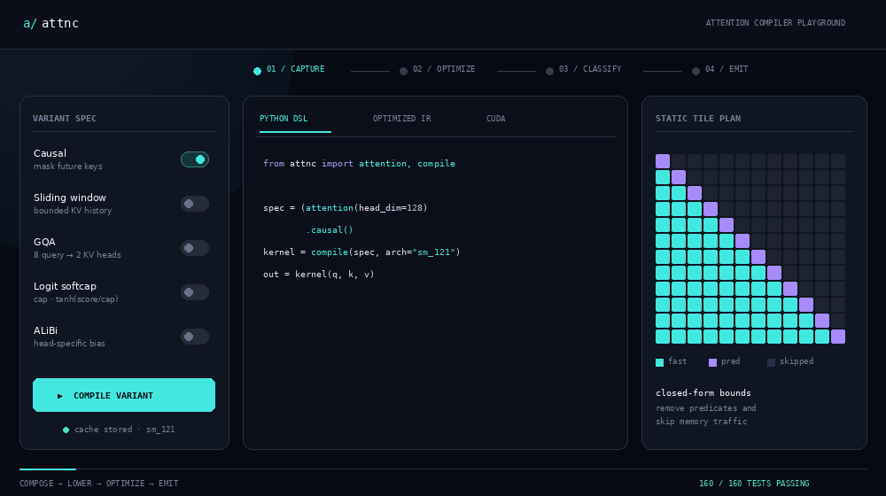
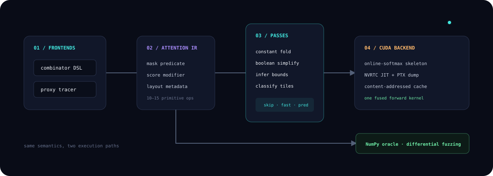

<div align="center">

# `attnc`

### An attention-variant compiler that turns Python semantics into one fused CUDA kernel.

[](https://www.python.org/)
[](src/attnc/codegen.py)
[](tests/test_attnc.py)
[](LICENSE)

**[▶ Try the interactive compiler playground](https://mneha05.github.io/attnc/)** · **[Read the design note](docs/DESIGN.md)** · **[Inspect the CUDA emitter](src/attnc/codegen.py)**

<br/>

<a href="https://mneha05.github.io/attnc/">
  
</a>

<sub><b>Live compiler explorer:</b> compose an attention variant and watch its Python DSL, optimized IR, generated CUDA, and static tile plan change together.</sub>

</div>

---

## The idea

FlashAttention made attention fast—but specialized. Modern models keep changing the operator: Mistral adds sliding windows, Gemma adds logit softcapping, serving stacks use GQA, and positional bias changes the score function. Each combination traditionally needs a hand-written kernel or falls back to a slower composition of eager operations.

`attnc` treats an attention variant as a **small program**:

1. Describe the mask, score modification, and layout in Python.
2. Lower both frontends into the same compact expression IR.
3. Simplify the program and prove which key tiles can be skipped.
4. Splice the optimized expressions into a fused online-softmax CUDA skeleton.
5. JIT with NVRTC, cache by IR/shape/architecture, and validate against an independent NumPy interpreter.

The result is one operator-family compiler, deliberately scoped tightly enough that every pass and every generated instruction can be understood.

## Ten-second example

```python
from attnc import attention, compile

spec = (attention(head_dim=128, dtype="fp16")
        .causal()
        .sliding_window(4096)
        .gqa(kv_heads=8)
        .softcap(50.0))

kernel = compile(spec, arch="sm_121")  # NVRTC JIT + content-addressed cache
out = kernel(q, k, v)                  # NumPy, CuPy, or CUDA Torch tensors
```

The same backend also accepts traced score and mask functions:

```python
from attnc import compile, table

slopes = table([0.25, 0.125, 0.0625, 0.03125], name="slopes")

def alibi(score, b, h, q_idx, kv_idx):
    return score - slopes[h] * (q_idx - kv_idx)

def window_mask(b, h, q_idx, kv_idx):
    return (q_idx >= kv_idx) & ((q_idx - kv_idx) < 4096)

kernel = compile(score_mod=alibi, mask_mod=window_mask,
                 head_dim=128, dtype="fp16", arch="sm_121")
```

That function runs once on proxy objects. Arithmetic, comparisons, boolean composition, intrinsics, and table lookups are recorded as IR—similar in spirit to the tracing layer behind larger Python compiler stacks, but small enough to read in an afternoon.

## Architecture

<p align="center">
  
</p>

| Stage | What it owns | Interesting detail |
|---|---|---|
| **Capture** | Immutable combinators + proxy tracer | Two user-facing APIs, one semantic representation |
| **Attention IR** | Mask predicate, score expression, layout metadata, constant tables | Serializable and stable-hashed for caching |
| **Middle end** | Constant folding, boolean simplification, bound inference | Unknown custom masks conservatively remain predicated |
| **Tile analysis** | `FULLY_MASKED`, `FULLY_UNMASKED`, or `PARTIAL` | Skips dead tiles and removes per-element predicates from fast tiles |
| **CUDA backend** | QK, score mod, online softmax, and PV | Never materializes the score matrix |
| **Runtime** | NVRTC, autotuning, cache, CuPy/Torch dispatch | Torch interop uses DLPack rather than a copy |
| **Oracle** | Dense NumPy interpretation of the same IR | Differential fuzzing makes compiler mistakes observable |

## What happens inside a generated kernel?

```cuda
for (int k0 = 0; k0 < NK; k0 += KV_TILE) {
    int tile = classify_kv_tile(q_idx, k0, k1);
    if (tile == FULLY_MASKED) continue;          // no memory traffic

    for (int kv_idx = k0; kv_idx < k1; ++kv_idx) {
        if (tile == PARTIAL && !mask(q_idx, kv_idx)) continue;

        float score = warp_sum(dot(q, k)) * scale;
        score = score_mod(score, h, q_idx, kv_idx);
        online_softmax_update(score, v, m, l, acc);
    }
}
```

For a causal sliding window, the compiler recognizes an allowed key interval for each query. Tiles outside it disappear, tiles entirely inside it take the unpredicated fast path, and only boundary tiles evaluate the mask.

<details>
<summary><b>Why softcap placement matters</b></summary>

The dot product is scaled first, then score modifiers are applied, then the value enters the online-softmax recurrence. A softcap is nonlinear—`cap · tanh(score / cap)`—so it cannot be moved across the recurrence or applied after softmax. The generated body keeps it exactly where the dense mathematical definition places it.

</details>

<details>
<summary><b>Why decode needs a query offset</b></summary>

A one-token decode query against a 32K KV cache represents absolute position `32767`, not position zero. `attnc` right-aligns non-square query and KV sequences by default, preventing a causal decode kernel from accidentally attending only the first key.

</details>

## Correctness before performance claims

The reference backend materializes the full score matrix in NumPy, applies the same IR, runs dense softmax, and multiplies by `V`. The test suite compares that independent path with compiler semantics across:

- **32 random seeds × 5 compositions = 160 differential cases**
- Causal, sliding-window, softcap, ALiBi, and combined variants
- MHA and GQA layouts
- Square prefill and non-square decode shapes
- Mask-composition and MHA/GQA equivalence properties
- Exact mask decisions and tolerance-based floating-point values

```bash
python -m unittest discover -s tests -v
# Ran 13 tests — OK
```

## Install and explore

```bash
git clone https://github.com/mneha05/attnc.git
cd attnc

pip install -e .                    # compiler + NumPy oracle
pip install -e '.[cuda,torch]'      # optional NVIDIA runtime + Torch interop
```

```bash
# Dump the optimized IR and emitted CUDA.
attnc --head-dim 128 --causal --window 4096 --softcap 50 \
  --arch sm_121 --dump-ir --dump-cuda kernel.cu

# Ask NVRTC for PTX when a compatible CUDA toolkit is installed.
attnc --head-dim 128 --causal --arch sm_121 --dump-ptx kernel.ptx
```

`backend="auto"` chooses CUDA when CuPy and a device are available and uses the NumPy oracle otherwise. CUDA inputs are contiguous `[batch, heads, sequence, head_dim]` tensors.

## Reproducible benchmark matrix

The harness compares the generated kernel with PyTorch SDPA, FlexAttention, and an optional hand-written adapter across decode at 1K/8K/32K and prefill at 2K/8K, for six variant families.

```bash
python benchmarks/bench.py --arch sm_75  --peak-gbps 320 \
  --output results-t4.json

python benchmarks/bench.py --arch sm_121 --peak-gbps YOUR_BOARD_VALUE \
  --handwritten your_package:run_attention \
  --output results-gb10.json
```

The repository deliberately does **not** claim an unmeasured CUDA speedup. `effective_gbps` uses logical tensor bytes for comparison; a literal DRAM percent-of-peak claim requires Nsight Compute counters. See the [benchmark protocol](benchmarks/README.md).

## Repository map

```text
src/attnc/
├── frontend.py      immutable combinator DSL
├── tracer.py        proxy-object score_mod / mask_mod tracer
├── ir.py            serializable expression and layout IR
├── passes.py        simplification + tile-bound analysis
├── codegen.py       fused CUDA C++ emitter
├── nvrtc.py         minimal PTX compiler binding
├── runtime.py       cache, autotuner, CuPy/Torch dispatch
└── interpreter.py   independent NumPy oracle

tests/               160-case differential + property suite
benchmarks/          T4 / GB10 comparison harness
docs/                live playground + compiler design note
```

## Scope and next milestones

Version `0.1` is a correctness-first forward compiler for contiguous KV on a single NVIDIA GPU. It intentionally does not include training/backward, multi-GPU execution, Windows support, or a general tensor compiler.

The next performance milestone is to replace the warp-per-query skeleton with the tensor-core prefill and context-split decode skeletons from `gb10-attn`, then report the generated kernel as a percentage of those hand-written ceilings. Paged-KV lowering and a `hetero-serve` backend are the next integration steps.

---

<div align="center">

Built by **[Neha Mahesh](https://github.com/mneha05)** · MIT licensed

If the compiler design is useful, open an issue with an attention variant you want it to express.

</div>
