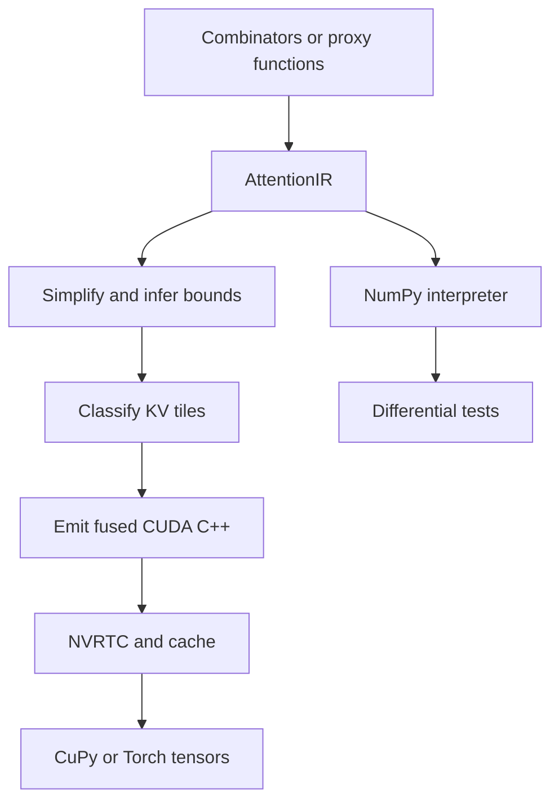

# Design

## Pipeline

The IR has expressions for constants, index variables, arithmetic, comparison,
boolean composition, selection, small table lookup, and a few math intrinsics.
Layout metadata is kept separate from score and mask semantics.

## Mask analysis

The pass recognizes causal and sliding-window predicates as an allowed key
interval for each query. A key tile is then classified as fully masked, fully
unmasked, or partial. Masked tiles are skipped. Unmasked tiles avoid the
element predicate. Unknown custom masks always use the safe partial path.

Decode queries use an explicit query offset; by default query positions are
right-aligned to the KV sequence. Thus a one-token decode query for a 32K cache
has position 32767 rather than position zero.

## Numerical semantics

The dot product is scaled before the score modifier. Modifiers run before the
online softmax recurrence. A softcap is emitted as
`cap * tanh(score / cap)`. The recurrence maintains running maximum `m`,
normalizer `l`, and an output accumulator, rescaling all three when a new
maximum arrives. Masked entries never enter the recurrence.

## Current CUDA kernel

The v0.1 backend is a correctness-first warp-per-query kernel. It is genuinely
fused and supports the full forward semantics, but is not yet the proposed
tensor-core prefill skeleton. The autotuner searches KV tile sizes; it does not
yet search warp layouts or pipeline stage counts. Performance claims belong in
the project only after running the supplied benchmark protocol.

## Deliberate scope

- Forward inference only; no backward pass or training.
- One operator family, not a general tensor-program compiler.
- Contiguous KV in v0.1. Paged KV is reserved for hetero-serve integration.
- Single GPU and Linux CUDA runtime.

